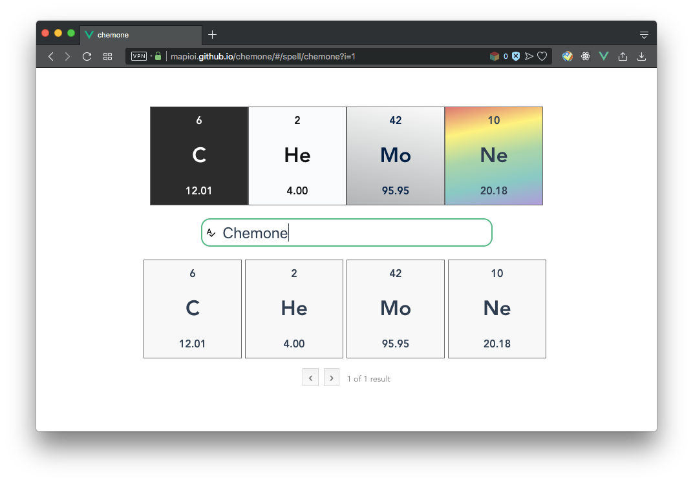
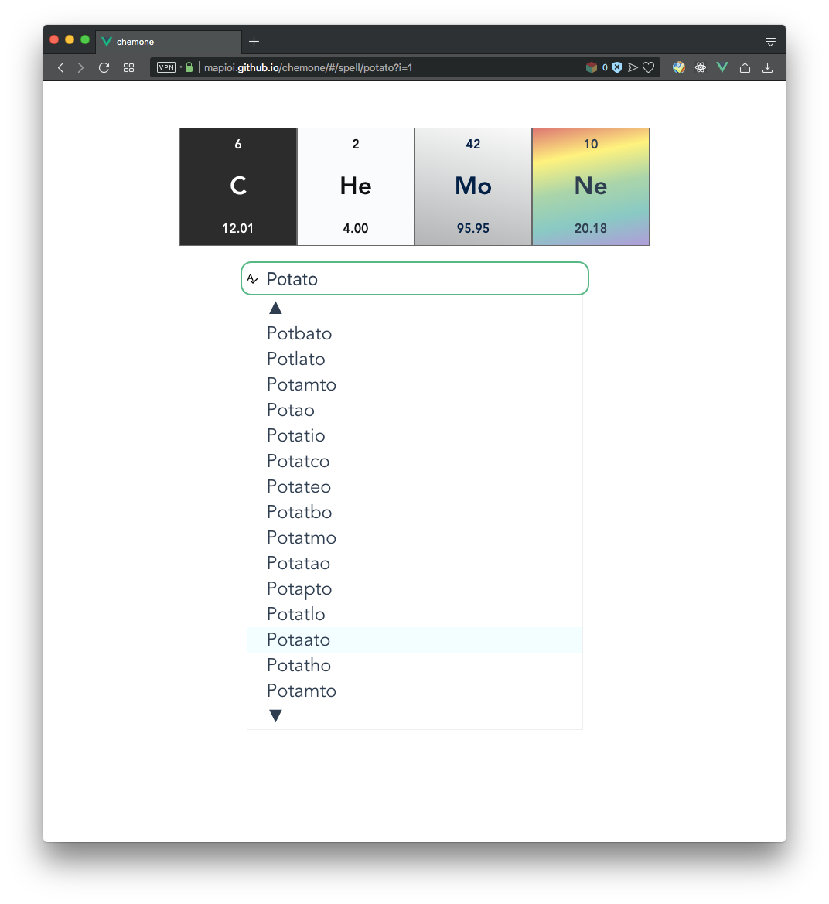
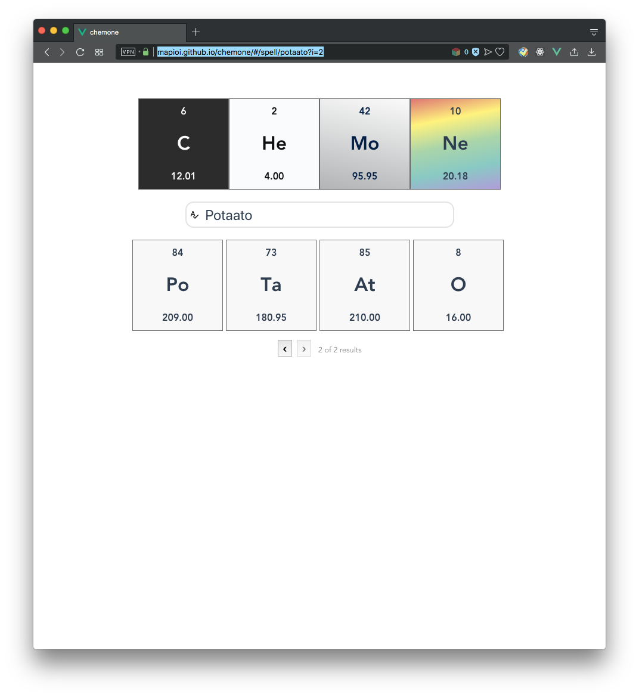

# Chemone

Spell words with chemical symbols.

https://mapioi.github.io/chemone/

## Gallery
### Spelling words

### Not spelling words
When a word cannot be spelt with chemical symbols, some suggestions that
either add a letter to the word or remove a letter from it are provided:

You can then choose the one that you feel is closest to the desired word:

Sometimes there are more than one way to spell the same word:

### Sharing
Simply copy the url after you have your word spelt.

## Technical details
This website is made with [Vue.js](https://vuejs.org).

### Online
You can use the website via https://mapioi.github.io/chemone/.

### Locally
To run the website locally, you need to have [Node.js](https://nodejs.org/en/) installed.

First, clone this repo:

    # ... cd to desired location
    git clone https://github.com/Mapioi/chemone
    cd chemone

Next, install dependencies:

    npm install
    # OR for yarn users
    yarn install

Then, start the website locally:

    npm run serve
    # OR
    yarn run serve

You might prefer to use [Vue CLI](https://cli.vuejs.org):

    npm install -g @vue/cli
    # OR
    yarn global add @vue/cli

    vue ui

## Non-technical stuff
* The name of this project was originally intended to be `chemon`,
  pronounced as c'mon, just to show the developers' frustration with
  javascript and css.
* The `e` in `chemone` was added because another java project with the
  same name was found on github (which was supposed to mean `chem on`).
* 1 entire hour is spent to center things.
* Due to technical difficulties, there are many words that remain to be
  not spellable - my name, "Jingjie" for example.
* By the way, this project is of no real use at all, if you are wondering.
